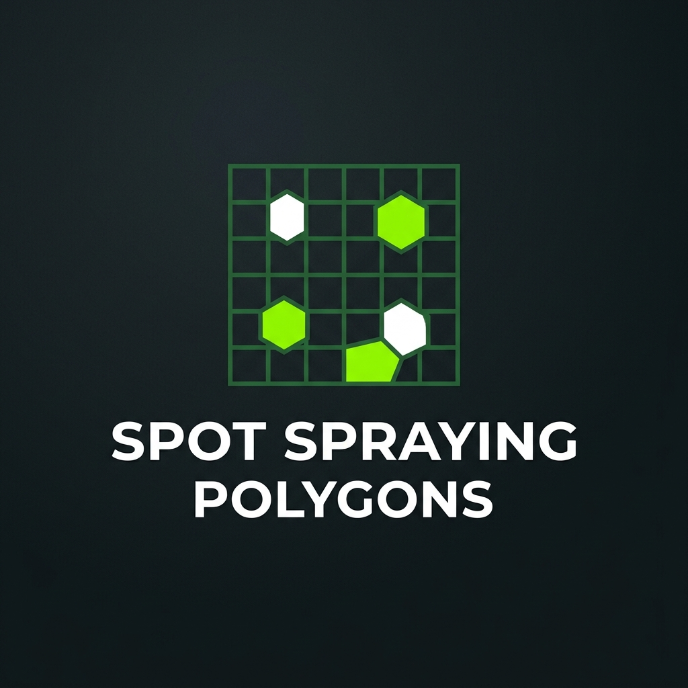
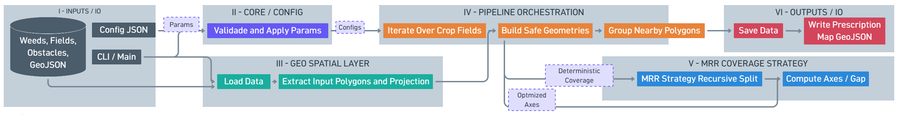

<a id="readme-top"></a>

<!-- PROJECT SHIELDS -->
[![Contributors][contributors-shield]][contributors-url]
[![Forks][forks-shield]][forks-url]
[![Stargazers][stars-shield]][stars-url]
[![Issues][issues-shield]][issues-url]
[![MIT License][license-shield]][license-url]
[![LinkedIn][linkedin-shield]][linkedin-url]

<!-- PROJECT LOGO -->
<br />
<div align="center">
  <a href="https://github.com/alissonpef/spot_spraying_polygons">
    
  </a>

  <h3 align="center">Spot Spraying Polygons</h3>

  <p align="center">
    Automatic generation of georeferenced spraying polygons for localized weed management in precision agriculture.
    <br />
    <a href="https://github.com/alissonpef/spot_spraying_polygons"><strong>Explore the docs »</strong></a>
    <br />
    <br />
    <a href="https://github.com/alissonpef/spot_spraying_polygons/issues/new?labels=bug">Report Bug</a>
    &middot;
    <a href="https://github.com/alissonpef/spot_spraying_polygons/issues/new?labels=enhancement">Request Feature</a>
  </p>
</div>

<!-- TABLE OF CONTENTS -->
<details>
  <summary>Table of Contents</summary>
  <ol>
    <li><a href="#about-the-project">About The Project</a></li>
    <li><a href="#system-architecture">System Architecture</a></li>
    <li><a href="#coverage-algorithms">Coverage Algorithms</a></li>
    <li>
      <a href="#algorithmic-foundations-mrr">Algorithmic Foundations (MRR)</a>
      <ul>
        <li><a href="#1-bounding-box--the-dominant-void-criterion">Bounding Box & The Dominant Void Criterion</a></li>
        <li><a href="#2-formal-algorithm--pseudocode">Formal Algorithm & Pseudocode</a></li>
        <li><a href="#3-computational-complexity-big-o-analysis">Computational Complexity</a></li>
      </ul>
    </li>
    <li><a href="#metric-suite">Metric Suite</a></li>
    <li><a href="#technologies">Technologies</a></li>
    <li>
      <a href="#getting-started">Getting Started</a>
      <ul>
        <li><a href="#prerequisites">Prerequisites</a></li>
        <li><a href="#installation">Installation</a></li>
      </ul>
    </li>
    <li>
      <a href="#usage">Usage</a>
      <ul>
        <li><a href="#interactive-dashboard-streamlit">Interactive Dashboard</a></li>
        <li><a href="#command-line-interface-cli">Command-Line Interface</a></li>
      </ul>
    </li>
    <li><a href="#configuration">Configuration</a></li>
    <li><a href="#limitations-and-future-work">Limitations and Future Work</a></li>
    <li><a href="#project-structure">Project Structure</a></li>
    <li><a href="#contributing">Contributing</a></li>
    <li><a href="#license">License</a></li>
    <li><a href="#contact">Contact</a></li>
  </ol>
</details>

<!-- ABOUT THE PROJECT -->
## About The Project

**Spot Spraying Polygons** is a tool designed to solve a crucial problem in modern agriculture: chemical product waste. Indiscriminate broadcast spraying generates financial loss and environmental damage. This tool acts as a **Tactical Profile Translator**, bridging the gap between raw computer vision detections and operational UAV path execution. It converts amorphous, georeferenced weed detection datasets into mathematically robust GeoJSON prescription maps, minimizing the treated area.

The core pipeline:
1. **Projection** — Reprojects all input geometries from WGS84 into a metric CRS (UTM, automatically selected from the centroid of the field).
2. **Clipping / Obstacle Avoidance** — Clips weed detections to the field boundary and optionally removes obstacle areas (with a configurable safety buffer).
3. **Buffering** — Expands each weed detection by a user-defined safety margin, approximated as a polygon with a configurable number of sides.
4. **Clustering** — Groups nearby buffered detections into contiguous patches using spatial proximity merging to form coherent treatment patches.
5. **Coverage** — Applies one of nine smart geometric strategies to produce minimal-area spraying polygons for each patch.
6. **Geometry repair** — Validates and optionally repairs invalid geometries at each stage using Shapely's `make_valid`.
7. **Line Routing & Metrics** — Generates zigzag spraying lines using shortest-path algorithms (Dijkstra) to connect passes, and provides a full efficiency report (IoU, turns, overspray waste).
8. **Export** — Reprojects the final polygons back to WGS84 and writes a GeoJSON `FeatureCollection`, compatible with agricultural drones and sprayer controllers.

<p align="right">(<a href="#readme-top">back to top</a>)</p>

## System Architecture



*The pipeline transforms computer vision detections into actionable UAV flight paths through a sequence of geometric operations.*

```text
data/input/
  weed*.geojson        ← Georeferenced weed detections (one file per field or merged)
  fields.geojson       ← Agricultural field boundaries
  obstacles.geojson    ← Optional obstacles (trees, buildings, water bodies)

src/
  core/                ← AlgorithmConfig dataclass, parameter validation, CRS resolution
  geo/                 ← Projection, geometry utilities, spatial indexing, extraction
  algorithms/
    clustering.py      ← Proximity-based patch grouping
    factory.py         ← Coverage context builder and rectangle splitting
    coverage/          ← Nine coverage strategy implementations
    engine.py          ← Main geometry engine (buffer → cluster → cover → clip → export)
  pipeline/            ← Field-by-field orchestration
  io/                  ← GeoJSON I/O utilities
  cli/
    main.py            ← spot-spray entry point
    tasks.py           ← Composite dev / lines / metrics / ui shortcuts
  utils/
    pulverization_lines.py   ← Spraying-line generator with zigzag routing and Dijkstra connectors
    metrics/
      geometric.py     ← Area, perimeter, turns, straight-line length, coverage waste
      iou.py           ← Pairwise IoU and weed-capture analysis between methods
      sensitivity.py   ← MRR sensitivity sweep over fill-ratio and depth parameters
      statistical.py   ← Likert-scale statistical tests for qualitative evaluation
  ui/
    app.py             ← Streamlit application
    map_renderer.py    ← Folium map builder
    algorithm_catalog.py ← Method metadata and parameter registry
    theme.py           ← Global CSS and sidebar styling
```

<p align="right">(<a href="#readme-top">back to top</a>)</p>

## Coverage Algorithms

Nine strategies are available, each suited to different field geometries and operational priorities:

| Key | Name | Description |
|-----|------|-------------|
| `mrr` | **Minimum Rotated Rectangle** | Fits the tightest possible rotated rectangle to each patch; recursively splits only when the fill ratio falls below a configurable threshold. Minimises area waste and favours long straight passes. |
| `bcd` | **Boustrophedon Cellular Decomp.** | Decomposes patches into axis-aligned cells for systematic back-and-forth coverage. Suitable for irregular shapes with complex contours. |
| `fixed-grid` | **Fixed Grid** | Overlays a regular grid on the patch and retains cells above a minimum fill ratio. Simple and repeatable. |
| `quadtree` | **Quadtree** | Recursively subdivides the bounding box, stopping when a cell is sufficiently filled or reaches a minimum size. Adapts resolution to local weed density. |
| `strip-based` | **Strip-Based** | Aligns parallel bands to the main axis of the patch. Favours long drone passes and is configurable by strip width and minimum fill. |
| `convex-hull` | **Convex Hull** | Single convex polygon enclosing all detections. Fast but may include weed-free area. |
| `concave-hull` | **Concave Hull (Alpha Shape)** | Adaptive concave polygon that follows voids and cutouts; concaveness controlled by alpha radius. |
| `aabb` | **Axis-Aligned Bounding Box** | Simplest conservative bound; zero rotational overhead for the flight controller. |
| `morph-closing` | **Morphological Closing** | Applies dilation followed by erosion to smooth patch boundaries and fill small holes; the weed buffer parameter acts as the structuring-element radius. |

All methods support:
- configurable **weed buffer** and **clustering distance**;
- configurable **obstacle safety buffer** with automatic subtraction;
- configurable **minimum polygon area** filter;
- optional **negative buffer** to shrink the final polygon inward;
- automatic **geometry repair** at every intermediate stage.

<p align="right">(<a href="#readme-top">back to top</a>)</p>

## Algorithmic Foundations (MRR)

The core contribution of this tool is the **Minimum Rotated Rectangle (MRR)** recursive decomposition. To bridge the gap between computer vision detections (which output arbitrary, highly irregular geometries) and operational UAV path execution (which requires straight, continuous flight lines to minimize turning maneuvers), the algorithm applies rigorous computational geometry. Rather than treating this merely as a systems-level post-processing step, we frame it as an adaptive geometric decomposition layer parameterized by a density threshold $\rho_{min}$.

### 1. Bounding Box & The Dominant Void Criterion

For each cluster of weed detections, the algorithm first computes the Convex Hull and, using the Shapely geometric library (which acts as an interface to the GEOS engine), finds the minimum-area enclosing rectangle. Under the hood, the library uses Toussaint's algorithm (known as Rotating Calipers) for this calculation. If this rectangle's fill ratio $\rho$ (weed area / rectangle area) falls below $\rho_{min}$, the region is bipartitioned to improve operational efficiency.

The critical step is identifying **the subdivision axis and the largest adjacent void**:
1. **Candidate Axes Selection:** We extract the two orthogonal axes defined by the edges of the current MRR.
2. **1D Projection:** The centroids of all internal weed patches are projected mathematically onto both candidate axes, yielding a set of 1D coordinates for each axis.
3. **Gap Detection:** The projections on each axis are sorted. We compute the Euclidean distances (gaps) between consecutive projected points. The largest contiguous gap across both axes is identified as the **dominant void**.
4. **The Split:** A cut line is drawn perpendicular to the axis, passing exactly through the midpoint of this dominant void. This guarantees that the split separates the cluster into two tighter geometric sub-groups without intersecting any weed patch. 

### 2. Formal Algorithm & Pseudocode

The method ensures convergence since each split strictly reduces the bounding area, and recursion is bounded both by a minimum area requirement and a maximum depth.

```text
Algorithm: Recursive MRR Decomposition
Input: 
  W (Weed cluster), ρ_min (Min Fill Ratio), d_max (Max Depth), 
  A_min (Min Area), τ_gap (Min void ratio, e.g., 0.1)
Output: Set of Spraying Rectangles

// Main implementation: src/algorithms/coverage/mrr.py -> MrrCoverageStrategy._split_recursive
Function Decompose(W, current_depth):
    // 1. Compute optimal bounding box
    H_W = ConvexHull(W)
    R_current = RotatingCalipers(H_W)
    
    // 2. Base Cases (Depth, Size, or Fill Ratio satisfied)
    if current_depth >= d_max or Area(R_current) < A_min:
        return { R_current }
        
    if (TotalArea(W) / Area(R_current)) >= ρ_min:
        return { R_current }
        
    // 3. Void Identification (Ref: src/algorithms/decomposition.py)
    Let A1, A2 be the orthogonal axes of R_current
    For each axis A in {A1, A2}:
        P_A = ProjectCentroids(W, A)
        Voids_A = ComputeGaps(Sort(P_A))
        
    // 4. Split Execution
    Let V_max be the largest gap found across Voids_A1 and Voids_A2
    Let projection_range = Length(R_current on Axis(V_max))
    
    if V_max < (τ_gap * projection_range):
        return { R_current } // No dominant void to justify a split
        
    SplitLine = OrthogonalLine(Midpoint(V_max), Axis(V_max))
    W_left, W_right = SplitCluster(W, SplitLine)
    
    // 5. Recursive decomposition
    return Decompose(W_left, current_depth + 1) ∪ Decompose(W_right, current_depth + 1)
```

### 3. Computational Complexity (Big-O Analysis)

The asymptotic behavior of the algorithm is dictated by the geometric operations at each recursive step:
- **Spatial Indexing & Base Clustering:** Grouping the initial $n$ detection points using an STRtree spatial index takes $\mathcal{O}(n \log n)$.
- **Convex Hull & MRR:** Computing the convex hull and applying rotating calipers takes $\mathcal{O}(n \log n)$ per cluster.
- **Void Identification:** Projecting points onto the axes takes $\mathcal{O}(n)$, but sorting these projections to find the maximum gap takes $\mathcal{O}(n \log n)$.
- **Recursion Depth:** Since the area $A$ is effectively divided at each step until it reaches $A_{\min}$, the tree depth is at most $\mathcal{O}(\log(A/A_{\min}))$. However, the algorithm enforces a hard upper bound $d_{\max}$.

Therefore, the worst-case time complexity for a cluster of $n$ points is bounded by:
> **$\mathcal{O}(n \log n \cdot \min(d_{\max},\, \log(A/A_{\min})))$**

This guarantees that the decomposition remains computationally tractable even for dense agricultural fields. By limiting the recursion depth and parameterizing the fill ratio, the algorithm provides a bounded, efficient, and mathematically sound bridge between raw visual detections and executable UAV trajectories, shifting the focus from ad-hoc systems post-processing to rigorous computational geometry.

<p align="right">(<a href="#readme-top">back to top</a>)</p>

## Metric Suite

Four independent analysis modules are provided. Note that geometric metrics such as *turns per hectare* and *straight-line length* act as direct **kinematic proxies** for UAV performance, strongly correlating with battery consumption, flight time, and inertial stress.

### Geometric Metrics (`geometric-metrics`)
Compares all generated methods side-by-side using spray-line data:
- Total spray area (ha) and area/perimeter ratio
- **Mean and standard deviation of straight-line segment lengths** (proxy for continuous flight speed)
- **Total number of heading changes (turns) and turns per hectare** (proxies for battery drain and maneuvers)
- Target coverage percentage and clean area waste percentage

### IoU Analysis (`iou-analysis`)
- Computes **Intersection over Union** between every pair of methods
- Reports pairwise agreement percentages and absolute areas
- Outputs CSV and Markdown tables

### MRR Sensitivity Analysis (`sensitivity-analysis`)
- Sweeps the `rectangle_min_fill_ratio` parameter from 0.00 to 0.50 (step 0.01) for three recursion depths (2, 4, 8)
- Tracks total spraying area, polygon count, IoU vs. ground truth, number of turns, mean straight-line length, and total estimated flight length
- Exports a multi-panel plot and a CSV/Markdown summary

### Likert Statistical Analysis (`likert-stats`)
- Processes qualitative evaluation data (Agronomist, Agronomic Coverage, Spraying Excess, Drone Operability, General Acceptability)
- Runs non-parametric statistical tests and exports formatted tables

<p align="right">(<a href="#readme-top">back to top</a>)</p>

## Technologies

[](https://www.python.org/)
[](https://shapely.readthedocs.io/)
[](https://pyproj4.github.io/pyproj/stable/)
[](https://geopandas.org/)
[](https://scipy.org/)
[](https://numpy.org/)
[](https://streamlit.io/)
[](https://python-visualization.github.io/folium/)

Core dependencies are declared in [`pyproject.toml`](pyproject.toml). The package is built with [Hatchling](https://hatch.pypa.io/latest/) and managed with [uv](https://docs.astral.sh/uv/).

<p align="right">(<a href="#readme-top">back to top</a>)</p>

## Getting Started

To get a local copy up and running, follow these simple steps.

### Prerequisites

This project requires Python 3.11 or later. We highly recommend using the **uv** package manager for an extremely fast and isolated installation.

- Install **uv** (if you don't have it yet):
  ```sh
  pip install uv
  ```

### Installation

1. Clone the repository:
   ```sh
   git clone https://github.com/alissonpef/spot_spraying_polygons.git
   cd spot_spraying_polygons
   ```
2. Install dependencies and create a virtual environment with **uv**:
   ```sh
   uv sync
   ```
3. Activate the virtual environment:
   - **Linux/macOS**:
     ```sh
     source .venv/bin/activate
     ```
   - **Windows**:
     ```sh
     .venv\Scripts\activate
     ```

<p align="right">(<a href="#readme-top">back to top</a>)</p>

## Usage

The project supports both visual execution and terminal execution.

### Interactive Dashboard (Streamlit)

To launch the web visualization interface in your browser:
```sh
uv run ui
# or directly:
uv run streamlit run src/ui/app.py
```

The Streamlit interface provides:
- **File inputs** — upload or use sample weed, field, and obstacle GeoJSON files.
- **Algorithm selector** — dropdown with all nine methods and per-method descriptions.
- **Parameter panel** — sliders and number inputs for all algorithmic variables.
- **Interactive map** — Folium map with colour-coded geometries and generated spraying polygons.
- **Edit panel** — individual spraying polygons or weed detections can be removed interactively before download.
- **GeoJSON export** — one-click download of the filtered result.

### Command-Line Interface (CLI)

After installation, the CLI commands are available. You can prefix them with `uv run` if the virtual environment is not activated.

1. **Polygon Generation (`spot-spray`)**:
   ```sh
   spot-spray \
     --weeds data/input/weed1.geojson data/input/weed2.geojson \
     --fields data/input/fields.geojson \
     --obstacles data/input/obstacles.geojson \
     --output data/output/spraying-mrr.geojson \
     --coverage_method mrr \
     --weed_buffer_m 1.5 \
     --merge_distance_m 8.0 \
     --obstacle_safety_buffer_m 3.0 \
     --min_polygon_area_m2 500
   ```

2. **Spraying Line Generation (`spraying-lines`)**:
   Generates boustrophedon (zigzag) flight lines from a polygon GeoJSON.
   ```sh
   # Single file
   spraying-lines <polygon.geojson> <distance_m> <angle_deg> --output-dir data/output/lines
   
   # Batch — processes every .geojson in a directory
   spraying-lines-batch data/output/polygons 2.0 0.0 --output-dir data/output/lines --recursive
   ```

3. **Batch Pipeline (`dev` / `process-method`)**:
   ```sh
   # Regenerates all nine methods with default parameters
   dev

   # Runs a single method with explicit parameters
   process-method mrr 1.0 5.0 3.0 --negative-buffer-m 0.3
   ```

4. **Metrics (`metrics`)**:
   ```sh
   # Run all metric modules in sequence
   metrics
   ```

<p align="right">(<a href="#readme-top">back to top</a>)</p>

## Configuration

All algorithm parameters are validated at construction time. Default values:

| Parameter | Default | Description |
|-----------|---------|-------------|
| `weed_buffer_m` | `1.0` | Expansion radius applied to each weed detection (m) |
| `merge_distance_m` | `5.0` | Maximum gap for grouping buffered patches (m) |
| `obstacle_safety_buffer_m` | `3.0` | Dilation applied to obstacles before subtraction (m) |
| `negative_buffer_m` | `0.5` | Inward shrink applied to the final polygon (m) |
| `min_polygon_area_m2` | `1000.0` | Polygons below this area are discarded (m²) |
| `rectangle_min_fill_ratio` | `0.45` | Minimum weed fill ratio before an MRR is split |
| `rectangle_max_depth` | `6` | Maximum recursion depth for MRR splitting |
| `max_polygon_sides` | `16` | Arc resolution for buffer approximation |
| `coverage_method` | `mrr` | Active coverage strategy |
| `grid_cell_size_m` | `2.0` | Fixed-grid and quadtree base cell size (m) |
| `grid_fill_threshold` | `0.35` | Minimum weed fill ratio to retain a grid cell |
| `quadtree_min_cell_size_m` | `1.0` | Minimum quadtree cell size (m) |
| `quadtree_fill_threshold` | `0.35` | Minimum fill ratio to retain a quadtree cell |
| `alpha_shape_radius_m` | `20.0` | Alpha radius for the concave hull (m) |
| `strip_width_m` | `3.0` | Width of each spraying strip (m) |
| `strip_fill_threshold` | `0.30` | Minimum fill ratio to retain a strip |
| `working_crs` | `None` | Override for the projected CRS (auto-selected from UTM otherwise) |
| `fix_invalid_geometries` | `True` | Apply `make_valid` whenever an invalid geometry is detected |

<p align="right">(<a href="#readme-top">back to top</a>)</p>

## Limitations and Future Work

While the geometric and kinematic proxies used in our evaluation (e.g., turns per hectare, straight-line flight length) provide strong indicators of operational efficiency, they remain approximations. Future work will focus on:
- **Real-world UAV Flight Experiments:** Validating the generated polygons through physical drone flights to measure exact battery consumption, actual flight time, and control smoothness.
- **Advanced Trajectory Optimization:** Integrating physical drone dynamics directly into the polygon generation constraints.

<p align="right">(<a href="#readme-top">back to top</a>)</p>

## Project Structure

```text
Spot-Spraying-Polygons/
├── data/
│   ├── input/          ← Sample weed, field, and obstacle GeoJSON files
│   └── output/
│       ├── polygons/   ← Generated spraying polygons (one file per method)
│       ├── lines/      ← Generated spraying-line GeoJSON files
│       ├── metrics/    ← CSV and Markdown metric reports
│       └── plots/      ← Sensitivity analysis plots
├── src/
│   ├── algorithms/     ← Clustering, factory, engine, and nine coverage strategies
│   ├── cli/            ← CLI entry points and composite task shortcuts
│   ├── core/           ← Configuration dataclass and constants
│   ├── geo/            ← Projection, geometry, spatial indexing, extraction
│   ├── io/             ← GeoJSON I/O
│   ├── pipeline/       ← Field-by-field pipeline orchestration
│   ├── ui/             ← Streamlit application and map renderer
│   └── utils/
│       ├── pulverization_lines.py   ← Spraying-line generator
│       └── metrics/                 ← Geometric, IoU, sensitivity, statistical modules
└── pyproject.toml
```

<p align="right">(<a href="#readme-top">back to top</a>)</p>

## Contributing

Contributions are what make the open-source community such an amazing place to learn, inspire, and create. Any contributions you make are **greatly appreciated**.

If you have a suggestion that would make this better, please fork the repository and create a pull request. You can also simply open an issue with the tag "enhancement".

1. Fork the Project
2. Create your Feature Branch (`git checkout -b feature/AmazingFeature`)
3. Commit your Changes (`git commit -m 'Add some AmazingFeature'`)
4. Push to the Branch (`git push origin feature/AmazingFeature`)
5. Open a Pull Request

### Top Contributors:

<a href="https://github.com/alissonpef/spot_spraying_polygons/graphs/contributors">
  
</a>

<p align="right">(<a href="#readme-top">back to top</a>)</p>

## License

Distributed under the MIT License. See [LICENSE](LICENSE) for more information.

<p align="right">(<a href="#readme-top">back to top</a>)</p>

## Contact

Alisson Pereira Ferreira - alissonpef@gmail.com - [LinkedIn](https://www.linkedin.com/in/alisson-pereira-ferreira/)

Project Link: [https://github.com/alissonpef/spot_spraying_polygons](https://github.com/alissonpef/spot_spraying_polygons)

<p align="right">(<a href="#readme-top">back to top</a>)</p>

---

Made with ❤️ by **Alisson Pereira**.

<!-- MARKDOWN LINKS & IMAGES -->
[contributors-shield]: https://img.shields.io/github/contributors/alissonpef/spot_spraying_polygons.svg?style=for-the-badge
[contributors-url]: https://github.com/alissonpef/spot_spraying_polygons/graphs/contributors
[forks-shield]: https://img.shields.io/github/forks/alissonpef/spot_spraying_polygons.svg?style=for-the-badge
[forks-url]: https://github.com/alissonpef/spot_spraying_polygons/network/members
[stars-shield]: https://img.shields.io/github/stars/alissonpef/spot_spraying_polygons.svg?style=for-the-badge
[stars-url]: https://github.com/alissonpef/spot_spraying_polygons/stargazers
[issues-shield]: https://img.shields.io/github/issues/alissonpef/spot_spraying_polygons.svg?style=for-the-badge
[issues-url]: https://github.com/alissonpef/spot_spraying_polygons/issues
[license-shield]: https://img.shields.io/github/license/alissonpef/spot_spraying_polygons.svg?style=for-the-badge
[license-url]: https://github.com/alissonpef/spot_spraying_polygons/blob/main/LICENSE
[linkedin-shield]: https://img.shields.io/badge/-LinkedIn-black.svg?style=for-the-badge&logo=linkedin&colorB=555
[linkedin-url]: https://www.linkedin.com/in/alisson-pereira-ferreira/